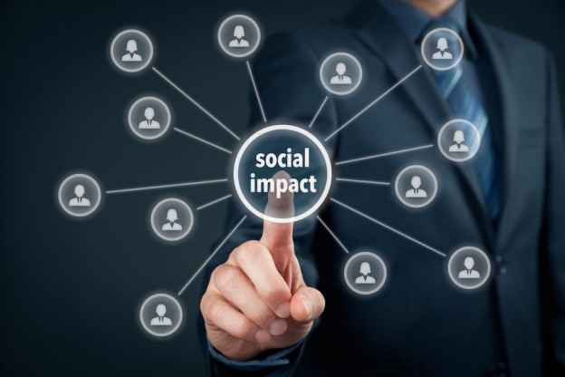

## Changing the World: Bit By Bit  

I have always loved understanding how and why things work. At a young age, I felt mesmerized sitting in front of the TV to watch *How It’s Made*, the machines whirring faster than the eye can see, completing their jobs with precision. Whether it is a computer program or a physical machine, there is something incredibly captivating about the engineering involved to design something. It feels so satisfying and therapeutic to mentally break something down and methodically rebuild it. Being able to be more creative and innovative scratched a certain itch for me that I sometimes struggled to get when I worked in healthcare.  

As I have begun advancing deeper into the field of computer science and software engineering, I have found particular interest in interdisciplinary work. My current academic and professional goals are driven by a desire to improve the world through tech. I have a particular interest in improving healthcare outcomes and reducing healthcare inequality. At the moment, I aspire to contribute to policies and technologies for more equitable healthcare outcomes through a [One Health approach](One Health | CDC). Having worked in healthcare, witnessing these disparities has been disheartening. I believe that understanding and addressing these challenges properly can result in effective and inclusive healthcare solutions, improving both quality and length of life. I’ve been so inspired seeing so many incredible advancements in technology being utilized to improve healthcare quality for so many healthcare providers and patients. Whether it is finding a method to make a procedure less invasive, building software to improve accessibility to medical care information or providers, or even improving models to predict health concerns more accurately to inform and empower doctors and patients, I feel excited knowing that there are so many ways that tech can be used to improve (and even save) so many lives.  

Going into the future, I hope to be able to potentially contribute to projects that may help us make these advancements through the power of programming and software engineering. I hope to keep expanding my toolbox with any tools and technologies that may help me achieve this goal. As I continue on my journey in computer science, I ultimately hope to be able to become qualified and skilled enough to be able to work on building meaningful projects with positive impact that will outlast my own time on Earth. 
