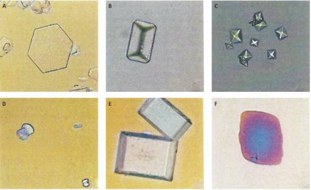

I worked closely with [Dr. Qunfeng Dong](https://ssom.luc.edu/indiri/people/faculty/qunfengdongphd/) and [Dr. Xiang Gao](https://ssom.luc.edu/medicine/faculty/profile/index.cfm?id=5146) at Loyola University Chicago to develop a bioinformatics strategy for a NIH-funded project called "A Microbial Model for the Formation of Calcium Oxalate and Calcium Phosphate Stones."

Previous research has shown that some bacteria are associated with kidney stones, and our team's goal was to test the hypothesis that those bacteria may contribute to the formation of kidney stones, and if they do contribute to the formation of kidney stones, how do they do it?

Using data on bacterial genomes and their metabolic pathways, we utilized statistical methods and R to compare the data for stone-associated bacteria (collected from kidney stones) and non-stone associated bacteria (collected elsewhere in the urinary system).

Through this project, I gained additional experience and skills in: Research, Statistics, Excel, R, Bioinformatics, KEGG ORTHOLOGY DATABASE, NCBI tools, and genomic related technologies like genome assembly and annotation, Unix, communication, scientific literature research and review, scientific presentations, and teammwork.  

[Learn more about the Loyola Adventures in Urobiome Data Program](https://ssom.luc.edu/luerec/administrative/laud/)  

Special thanks to: 
My LAUD Program mentors and my fellow research partner, Elise
