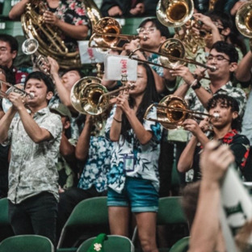

Over the course of the past decade or so, I have been blessed to be a member of numerous performance groups, and I have played a variety of band literature spanning across many genres.

I have played in: 
Concert/Symphonic/Wind Ensembles (Trombone and Bassoon) 
Concert/Symphonic Orchestras (Trombone) 
Pep Bands (Trombone) 
Pit Orchestras for *Rodger's and Hammerstein's Cinderella* and *The Sound of Music* (Trombone and Bassoon) 
International Southern Winds Tour Group across Europe  

As of now, I am currently involved in the [University of Hawaii Marching Band](https://uhbands.org/athleticbands/), the University of Hawaii Pep Band, and (if I have time in my academic schedule) the University of Hawaii Concert Ensembles. 
The UH Band Program is the only university marching band in the state of Hawai'i, and it is the one of the largest and most diverse student organizations on campus, playing at many events around campus. I aim to be a friendly face and create a safe and supportive educational environment that is conducive to growth for musicians of all skill levels.  

Being able to play trombone has been an important transformative experience for me. I have met so many incredible mentors and friends through the fine arts. Not only have I grown in my musicianship, but I have also grown as a person and as a performer. Band builds skills in: focus, collaboration and teamwork, leadership, musicianship, discipline and commitment, adaptability, and general communication and listening. In addition to this, my experiences in band have given me a wider world view and a deeper connection with a diverse population of people who are all united by music.   

Special thanks to my educators and for the parents for giving me these opportunities and for sitting through my beginner "Hot Cross Buns" practice sessions.

