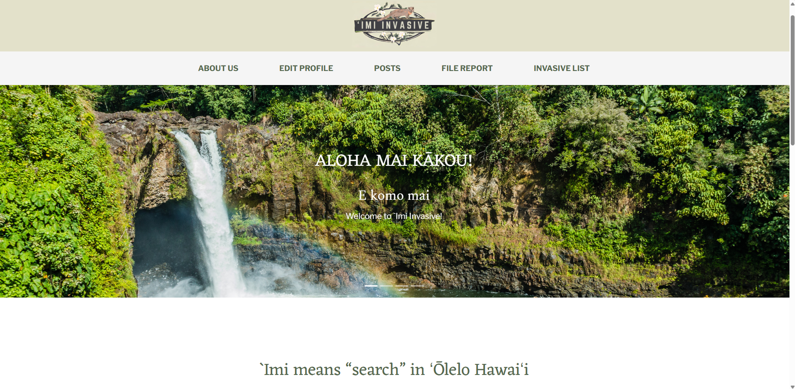
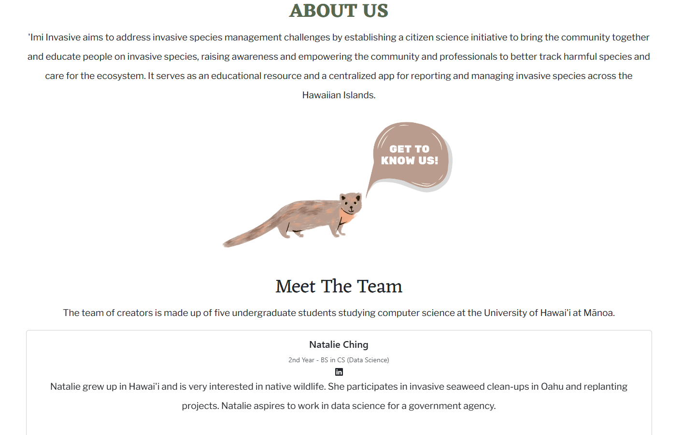
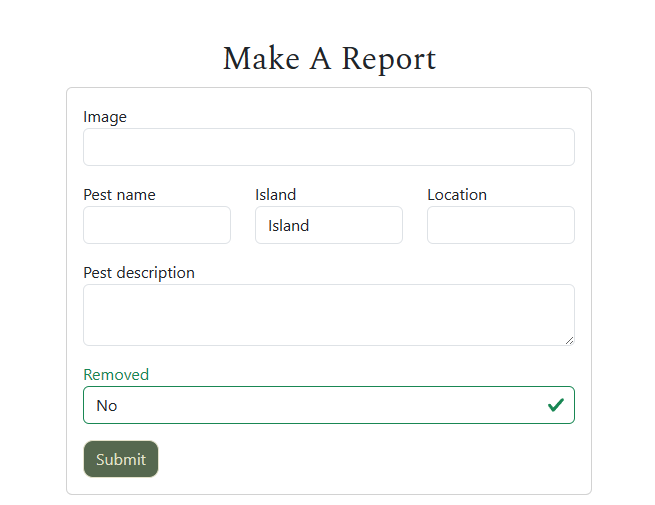
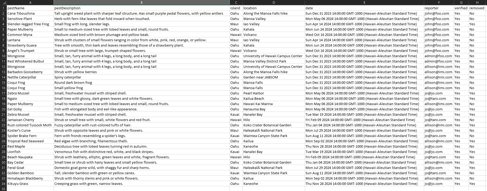

  

## Project Overview
Invasive species pose a significant threat to local ecosystems, causing ecological imbalances or even extinction. This is particularly dangerous in ecosystems such as Hawaii where many endemic species are at risk. However, monitoring and tracking these invasive species across the Hawaiian islands can be a daunting and resource-expensive task, making research difficult to complete.  

‘Imi Invasive aims to address invasive species management challenges by establishing a citizen science initiative to bring the community together and educate people on invasive species, raising awareness and empowering the community and professionals to be able to better track the harmful species and care for the ecosystem. It aims to serve as an educational resource and also a centralized app for people to report and help manage invasive species across the Hawaiian Islands.  

## Personal Contributions and Examples
For this project, I was the original creator of the project pitch. I mainly worked on the constructing the databases, managing database data, the "about us" page, the functional report-data-to-csv button, bugfixing and maintenance (tidying up), and app deployment to Digital Ocean. In addition to this, I explored building a backend for image upload using Amazon S3 and also integrating OpenAI Vision to help assist with invasive species recognition, but those parts unfortunately did not make it to the final project. Here are a few examples of my work that did make it to the final project. Click on the relevant images to see the source code!  

The About Us Page 
    

  The Report Form Page 
    

  The Download CSV Button and Example Output 
 <a href="https://github.com/islandinvaders/imi-invasive/blob/main/app/imports/ui/components/DownloadButton.jsx"> 
  </a> 

## Takeaways
Through this awesome experience, I learned a lot about open source software development with a team, communication, website deployment, database management, good software engineering practices, user interface frameworks, S3, OpenAI, and agile project management.  

[Click here to learn more about the project!](https://islandinvaders.github.io/) 
[Check out our project on Github](https://github.com/islandinvaders/imi-invasive) 

Mahalo nui loa to all of the following: 
Natalie Ching (teammate, and creator of the awesome logo)  
Lily Enanoria (teammate) 
Myra Ortigosa (teammate) 
Gian Panoy (teammate) 
The UH Manoa ICS 314 Faculty 
