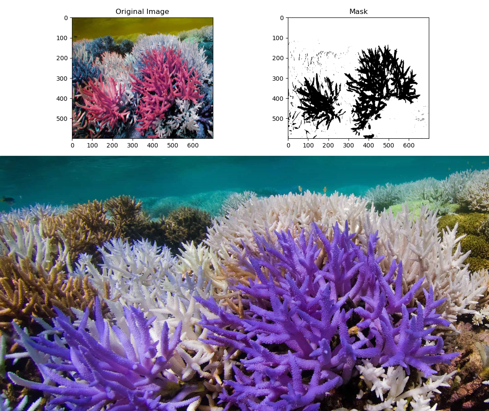
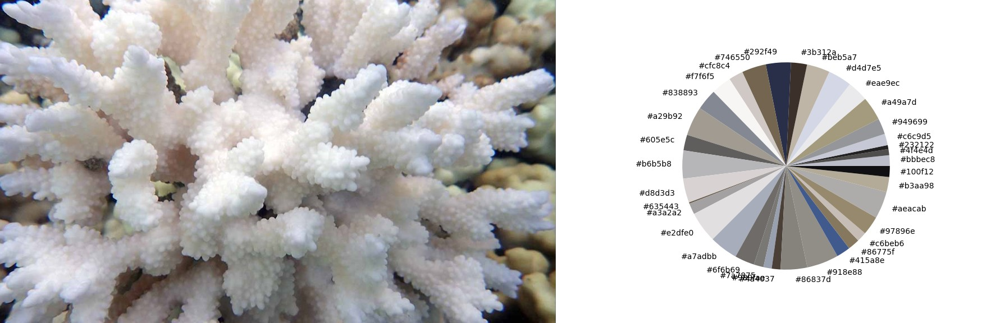
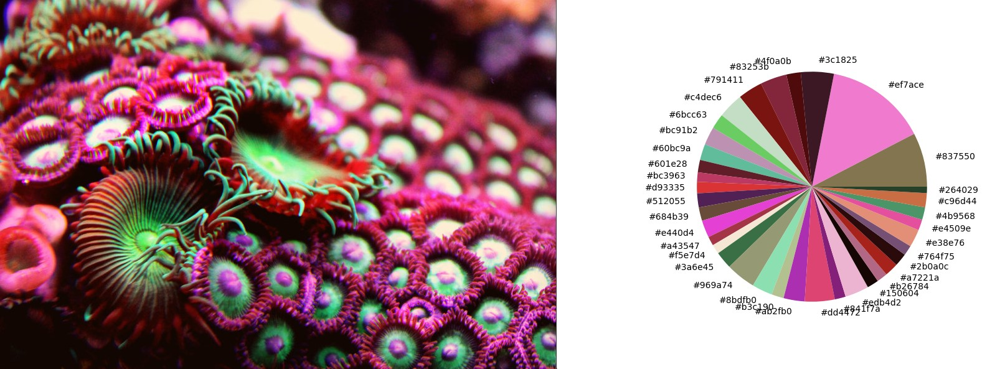
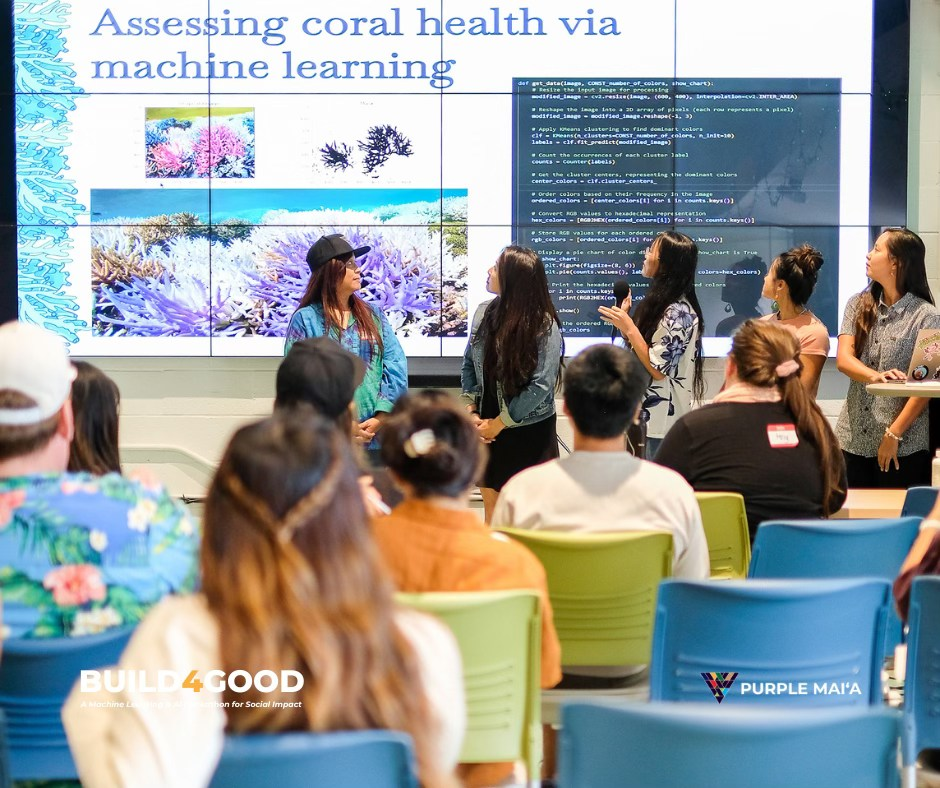
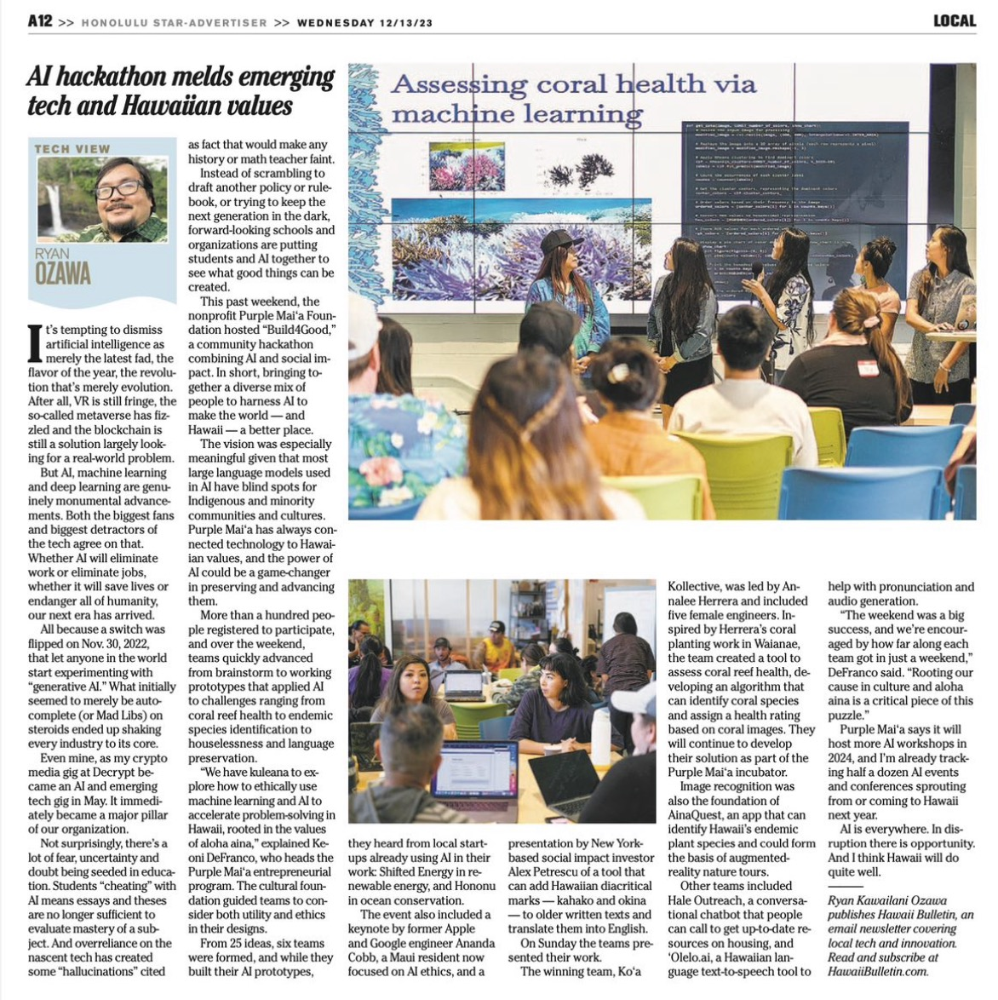

  
  
  
  
  

"The Build4Good Hackathon spans three dynamic days of innovation and collaboration. It commences with an inspiring kickoff, where participants gather to explore challenges in our focus areas. Teams form, ideas are honed, and development plans take shape. The second day is a deep dive into coding, modeling, and mentor-guided progress, with concurrent workshops enriching participants’ technical skills. On the final day, teams present their solutions to a panel of expert judges, focusing on innovation, societal impact, and technical excellence.
Beyond the event, ongoing support and connections facilitate the implementation of solutions, fostering a lasting community committed to deploying AI and ML for meaningful social change. Throughout, inclusivity, diversity, and participant well-being remain paramount, ensuring a welcoming environment for all contributors." 

[Description via the Build4Good Event Page](https://purplemaia.org/event/build4good/)  

For this project, I was the lead Python programmer responsible for getting the quantitative data from uploaded coral images. Researching and utilizing the OpenCV package and the K-means clustering algorithm, I wrote a program that takes an image, finds the most dominant colors in the image, and returns the data as a pie chart which dislays the colors found in the image and their approximate frequency.
Additionally, I also wrote code to analyze an image and highlight corals in the image that match a chosen coral color selected from a standard set of colors established by the [Hawaiian Ko'a Card](https://coralwatch.org/wp-content/uploads/2023/11/2020_Bahr-etal-The-Hawaiian-Ko%CA%BBa-Card-coral-health-and-bleaching-assessment-tool.pdf).  

[Learn more about Purple Mai'a](https://purplemaia.org/about/)  
[Check out our final presentation](https://docs.google.com/presentation/d/1dKP6ula-J-_ap4F8JT8bMd7L-gqq9FQ46dloCljvQjo/edit?usp=sharing)

Mahalo nui loa to all of the following: 
Purple Mai'a 
The Ko'a Kollective Team 
Honolulu Star Advertiser 
